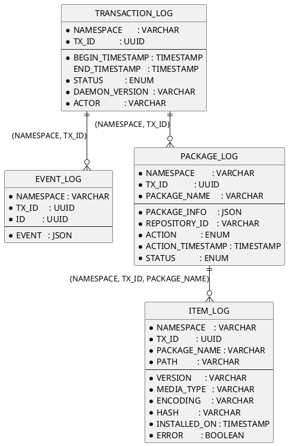

```plantuml
@startuml

hide circle
skinparam linetype ortho

entity TRANSACTION_LOG {
    * NAMESPACE       : VARCHAR
    * TX_ID           : UUID
    --
    * BEGIN_TIMESTAMP : TIMESTAMP
      END_TIMESTAMP   : TIMESTAMP
    * STATUS          : ENUM
    * DAEMON_VERSION  : VARCHAR
    * ACTOR           : VARCHAR
}

entity EVENT_LOG {
    * NAMESPACE : VARCHAR
    * TX_ID     : UUID
    * ID        : UUID
    --
    * EVENT   : JSON
}

entity PACKAGE_LOG {
    * NAMESPACE        : VARCHAR
    * TX_ID            : UUID
    * PACKAGE_NAME     : VARCHAR
    --
    * PACKAGE_INFO     : JSON
    * REPOSITORY_ID    : VARCHAR
    * ACTION           : ENUM
    * ACTION_TIMESTAMP : TIMESTAMP
    * STATUS           : ENUM
}

entity ITEM_LOG {
    * NAMESPACE    : VARCHAR
    * TX_ID        : UUID
    * PACKAGE_NAME : VARCHAR
    * PATH         : VARCHAR
    --
    * VERSION      : VARCHAR
    * MEDIA_TYPE   : VARCHAR
    * ENCODING     : VARCHAR
    * HASH         : VARCHAR
    * INSTALLED_ON : TIMESTAMP
    * ERROR        : BOOLEAN
}

TRANSACTION_LOG ||--o{ EVENT_LOG   : "(NAMESPACE, TX_ID)"
TRANSACTION_LOG ||--o{ PACKAGE_LOG : "(NAMESPACE, TX_ID)"
PACKAGE_LOG     ||--o{ ITEM_LOG    : "(NAMESPACE, TX_ID, PACKAGE_NAME)"

@enduml
```